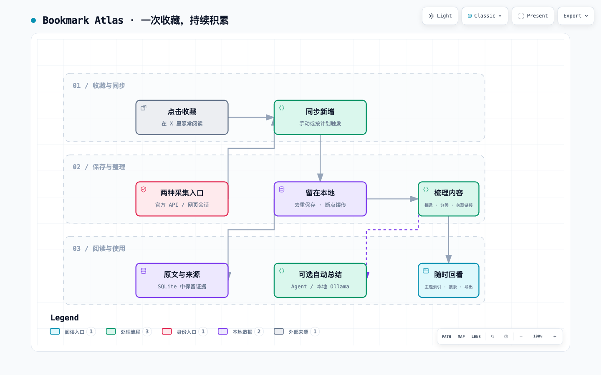

# Architecture and site expansion

The bookmark-to-Wiki workflow:

## Boundaries

- `adapters/`: site-specific authentication and response normalization. The first release exposes X only; other sites are not advertised as supported.
- `models.py`: adapter protocol and normalized `Identity`, `Item`, `Page` records.
- `sync.py`: preflight, conservative fallback, overlap scan, older-history resume, and process locking.
- `store.py`: schema version 2, separate bookmark/watch memberships, origin tracking, raw pages, checkpoints, runs, change events, analyses and failures.
- `analysis.py`: versioned analysis engines; content hashes invalidate stale results.
- `export.py`: raw JSON and readable local Markdown artifacts with escaped source text.
- `oauth.py`: PKCE S256, state validation, loopback callback, token exchange and private storage.

## Incremental semantics

Item identity is `(site, item_id)`. A site's archive is bound to one account ID; separate accounts require separate data directories. A newly collected old post is still new because discovery compares bookmark memberships rather than post dates.

Every successful response page, its normalized items, source records, membership changes, and the next historical cursor are committed in a single SQLite transaction. A failed page never advances the checkpoint. Process locking prevents concurrent writers. Interrupted runs leave committed pages intact.

Every run starts at the collection head. The default overlap is two **entirely known pages**. Mixed old/new pages do not terminate an incremental pass. After the head scan, a stored historical cursor resumes an incomplete backfill. `--full` ignores overlap and traverses from the beginning within the page budget. API and web cursors are independent.

Absence is never interpreted as deletion. Media metadata and external links are preserved, but the current release does not download media binaries or crawl linked pages/whole threads. Shorter content never overwrites a longer captured post. This conservative merge can retain an older long version if a post is edited into a shorter one; raw response pages preserve the observations for future reconciliation.

Auto mode tries the preferred adapter, verifies identity and one bookmark page, and can switch on missing authorization, unusable API credits, or an unavailable endpoint before page commits. It records fallback reasons. After writes begin, it stops and preserves the checkpoint on failure. It never falls back on rate limits, identity mismatch, or unrecognized data structures.

## Adding another site

1. Confirm the site's authorized access route and collection paging behavior.
2. Implement an adapter, with a stable site key and server-verified account identity.
3. Register it in the CLI factory and site choices; the storage and analysis layers remain shared.
4. Add synthetic transport tests and a bounded live smoke test with the owner's authorization.
5. Document incomplete coverage and authentication expiry clearly.

Potential future targets are GitHub Stars, Reddit saved items, YouTube playlists, and other explicitly authorized collections. They are roadmap candidates, not implemented features.

## Preferences and Agent Wiki

`preferences.py` validates private settings and computes daily runs in an explicit timezone. Saving settings does not activate a background service. CLI options override saved choices.

`wiki.py` prepares generated source pages and a content-hash queue. An Agent reads these sources and submits structured notes through `wiki apply`. The whole batch is validated before notes are written; progress is saved only after all note writes. Changed sources return to the queue. Generated notes and user-authored `personal/` files are separate. The Agent Skill supplies the synthesis workflow; the CLI does not automatically call an Agent service.

## Directed collection

`watch.py` resolves author rosters, filters time, language, text keywords and post type, and rotates bounded author batches. Each rule configuration and author has an independent membership and cursor stream; `items` remain shared. Changing a rule starts a new collection stream. Automatic transport fallback for watches occurs during identity/roster access; a timeline failure stops that run and preserves committed pages.

`taxonomy.py` validates private topic and note-type dictionaries. Wiki notes keep classification sidecars, source references and validated related-note links; the index groups notes by topic and `log.md` records compilations.
